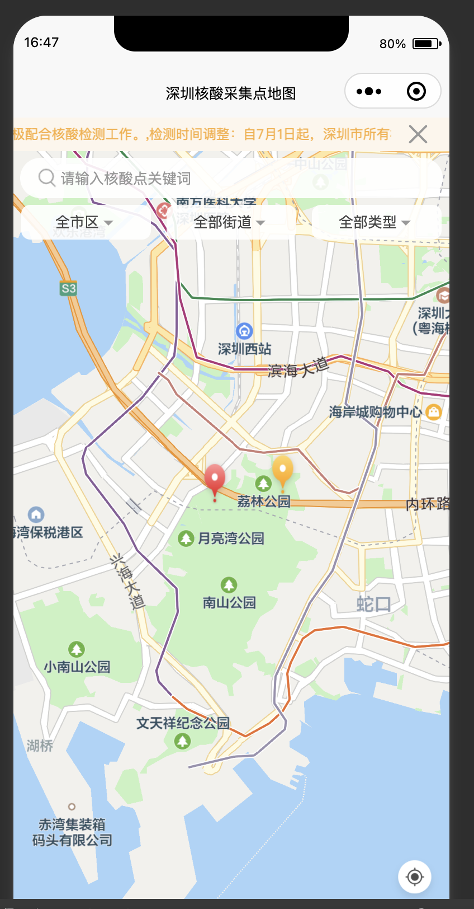

# 深圳核酸采集点地图 (uniApp/H5)

这是一个用于展示核酸检测点信息的微信小程序/H5，包括地图定位、标记点显示、通知栏、弹出层等功能。

## 功能描述
1. 地图显示
使用微信小程序地图组件展示地图。
展示用户当前位置及附近的核酸检测点。
2. 标记点
在地图上展示核酸检测点的标记。
点击标记点弹出详细信息。
3. 通知栏
顶部显示通知内容，可关闭。
4. 弹出层
点击标记点后，显示详细信息的弹出层。

## 开发说明
获取用户位置
通过 uni.getLocation 获取用户当前位置，并在地图上标记出来。

地图组件
使用微信小程序 map 组件显示地图，标记点通过 markers 属性设置。

弹出层
使用 u-popup 组件展示弹出层，包含核酸检测点的详细信息。

事件处理
onControltap：重置地图位置。
markertap：点击标记点显示详细信息。
closePopup：关闭弹出层。
样式
使用 SCSS 编写样式，确保各组件的样式统一且响应式。

## 技术栈
uniapp
Vue.js
Vuex
SCSS
QQMapWX（腾讯地图）

## 项目页面预览

相关预览示例，在 prview 文件夹里

## 贡献
欢迎贡献代码！请遵循以下步骤：

Fork 这个仓库。
创建一个分支 (git checkout -b feature-foo)。
提交你的修改 (git commit -am 'Add some feature')。
推送到分支 (git push origin feature-foo)。
创建一个新的 Pull Request。

## 许可
仅用于学习交流，不得用于商业用途。